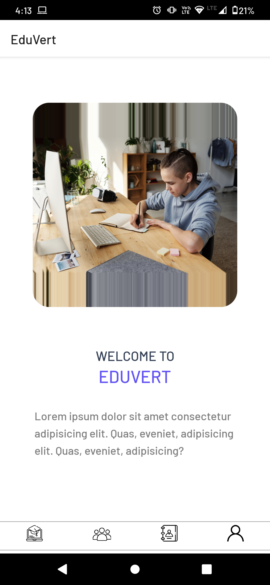
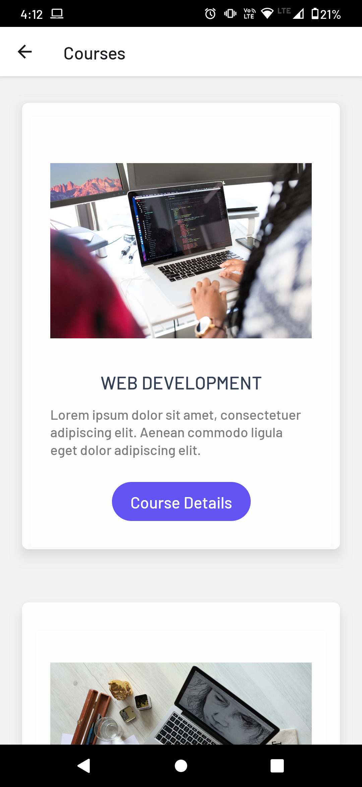
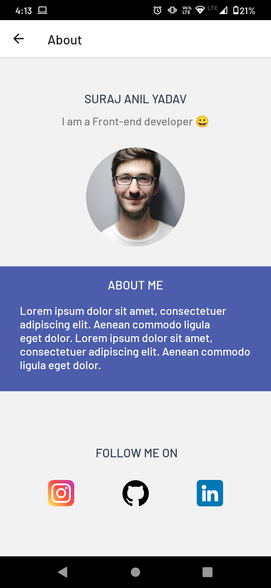

 <h1>Edu-Vert</h1>

## Description 🦚

Welcome to our React-Native EduVert app project!

Our EduVert app project is a application that allows users to browse and search programming courses.

Some of the key features of our EduVert apk project include:

- **APK**
- **Courses catalog**
- **Search courses**

## Screenshots 🖼

- **Home Page**  
      
- **Courses**  
      
- **Profile Page**  
      
- **Contact**  
      

## ToDo

- [ ] Working on Realtime API's Courses and Multiple user's Login and Registraion.
